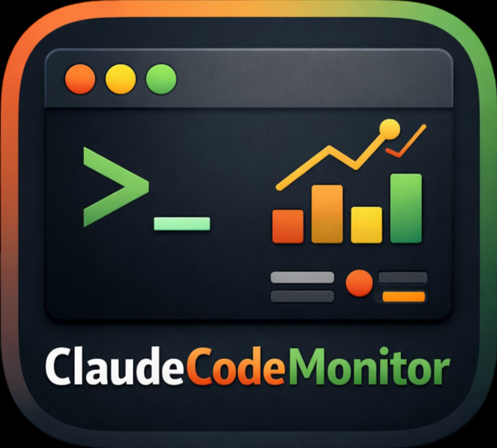
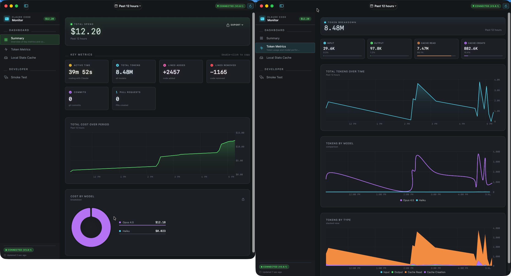
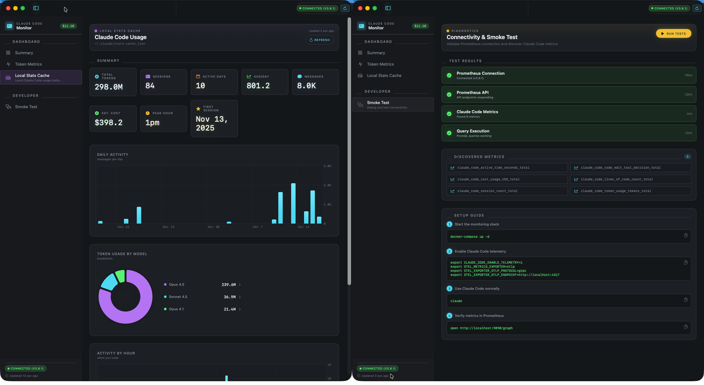

# Claude Code Monitor

<p align="center">
  
</p>

A native macOS application for monitoring Claude Code usage via Prometheus telemetry data.

<p align="center">
  
</p>

<p align="center">
  
</p>

## Features

- **Summary Dashboard**: Real-time KPIs with cost rate and model breakdown charts
- **Performance Dashboard**: Token metrics by model and type (input/output/cache)
- **Historical Dashboard**: View metrics over custom time ranges with independent time selector
- **KPI Cards**: Tokens, Cost, Active Time, Sessions, Lines Added/Removed, Commits, PRs
- **Charts**: Token rate, cost rate, model breakdown (using Apple Charts)
- **Menu Bar Mode**: Quick glance at current metrics without opening the full app
- **Smoke Test**: Validate Prometheus connectivity and discover available metrics
- **Settings**: Configurable Prometheus URL, refresh intervals, and filters

## Quickstart

### 1. Clone the Repository

```bash
git clone https://github.com/cragr/ClaudeCodeMonitor.git
cd ClaudeCodeMonitor
```

### 2. Start the Monitoring Stack

Start the OpenTelemetry Collector and Prometheus using Podman (or Docker):

```bash
podman compose up -d
```

Or with Docker:

```bash
docker compose up -d
```

This starts:
- **OpenTelemetry Collector** (ports 4317/gRPC, 4318/HTTP, 8889/metrics)
- **Prometheus** (port 9090)

### 3. Configure Environment Variables

Add the following to your shell profile:

**For Zsh (~/.zshrc):**
```bash
echo '# Claude Code Telemetry
export CLAUDE_CODE_ENABLE_TELEMETRY=1
export OTEL_METRICS_EXPORTER=otlp
export OTEL_EXPORTER_OTLP_PROTOCOL=grpc
export OTEL_EXPORTER_OTLP_ENDPOINT=http://localhost:4317' >> ~/.zshrc
```

**For Bash (~/.bashrc):**
```bash
echo '# Claude Code Telemetry
export CLAUDE_CODE_ENABLE_TELEMETRY=1
export OTEL_METRICS_EXPORTER=otlp
export OTEL_EXPORTER_OTLP_PROTOCOL=grpc
export OTEL_EXPORTER_OTLP_ENDPOINT=http://localhost:4317' >> ~/.bashrc
```

### 4. Reload Your Shell Profile

```bash
# For Zsh
source ~/.zshrc

# For Bash
source ~/.bashrc
```

### 5. Verify Environment Variables

```bash
echo $CLAUDE_CODE_ENABLE_TELEMETRY    # should output: 1
echo $OTEL_METRICS_EXPORTER           # should output: otlp
echo $OTEL_EXPORTER_OTLP_PROTOCOL     # should output: grpc
echo $OTEL_EXPORTER_OTLP_ENDPOINT     # should output: http://localhost:4317
```

### 6. Start Using Claude Code

Run Claude Code to start generating metrics:

```bash
claude
```

Use Claude Code normally - metrics will be automatically sent to the monitoring stack.

### 7. Install and Run the Monitor App

1. Download the latest `ClaudeCodeMonitor.dmg` from the [Releases](https://github.com/cragr/ClaudeCodeMonitor/releases) page

2. Open and drag `ClaudeCodeMonitor.app` to your Applications folder

3. Launch the app from Applications

The app will connect to Prometheus and display your Claude Code usage metrics.

### 8. Verify Setup

1. Open the app
2. Go to "Smoke Test" tab in the sidebar
3. Click "Run Tests"
4. All tests should pass (green checkmarks)

If metrics aren't showing:
- Ensure the monitoring stack is running: `podman compose ps`
- Check Prometheus targets: http://localhost:9090/targets
- Use Claude Code to generate some metrics
- Wait a few minutes for metrics to be scraped

## Usage

### Summary Dashboard
- Shows KPIs for the selected time range (15m, 1h, 12h, 1d, 1w, 2w, 1mo)
- Auto-refreshes based on configured interval
- Displays cost rate over time and cost breakdown by model
- Shows tokens, cost, active time, sessions, lines of code, commits, PRs

### Performance Dashboard
- Token usage time series with breakdown by model and type
- Token types: input, output, cacheRead, cacheCreation
- Detailed token metrics with charts

### Historical Dashboard
- Independent time selector from global toolbar
- Usage overview with stats equivalent to `claude /stats` command
- Usage trends charts and productivity metrics

### Menu Bar
- Click the chart icon in the menu bar for quick stats
- Shows tokens, cost, and active time at a glance
- Click "Open Dashboard" for full app

### Settings
- **General**: Default time range, refresh interval, menu bar options
- **Connection**: Prometheus URL, connection test
- **Filters**: Filter by terminal type, model, or app version

## Supported Metrics

| Metric | Description |
|--------|-------------|
| `claude_code.session.count` | Number of CLI sessions |
| `claude_code.token.usage` | Total tokens used |
| `claude_code.cost.usage` | Cost in USD |
| `claude_code.active_time.total` | Active coding time (seconds) |
| `claude_code.lines_of_code.count` | Lines added/removed |
| `claude_code.commit.count` | Git commits created |
| `claude_code.pull_request.count` | PRs created |
| `claude_code.code_edit_tool.decision` | Code edit decisions |

### Available Labels
- `session.id` - Session identifier
- `user.account_uuid` - User account UUID
- `organization.id` - Organization ID
- `terminal.type` - Terminal type (iTerm, Terminal, etc.)
- `app.version` - Claude Code version
- `model` - Claude model used

## Troubleshooting

### "Not Connected" Error
1. Check if Prometheus is running: `podman compose ps`
2. Verify Prometheus URL in Settings (default: http://localhost:9090)
3. Test connection in Settings → Connection → Test Connection

### No Metrics Showing
1. Ensure telemetry is enabled: `echo $CLAUDE_CODE_ENABLE_TELEMETRY`
2. Check OTel settings:
   ```bash
   echo $OTEL_METRICS_EXPORTER          # should be: otlp
   echo $OTEL_EXPORTER_OTLP_PROTOCOL    # should be: grpc
   echo $OTEL_EXPORTER_OTLP_ENDPOINT    # should be: http://localhost:4317
   ```
3. Use Claude Code to generate some metrics
4. Check Prometheus has the target: http://localhost:9090/targets
5. Query Prometheus directly: http://localhost:9090/graph
   - Try: `{__name__=~"claude.*"}`

## Building & Distribution

For information on building from source, running tests, and distributing the app, see [BUILD.md](BUILD.md).

## License

MIT
