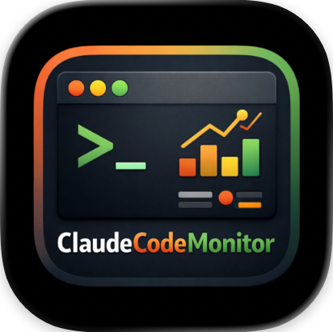

# Claude Code Monitor

<p align="center">
  
</p>

A cross-platform desktop application for monitoring Claude Code usage via Prometheus telemetry. Runs on **macOS**, **Linux**, and **Windows**.


## Features

- **Summary Dashboard** - Real-time KPIs with cost tracking and model breakdown
- **Token Metrics** - Token usage by model and type (input/output/cache)
- **Insights** - Usage trends, comparisons, and productivity metrics
- **Sessions** - Cost by session and project analysis
- **System Tray** - Quick stats at a glance
- **Auto-Updates** - Stay current with automatic update checks

## Quickstart

### 1. Install Prerequisites

**Choose your platform:**

- [macOS](docs/installation/macos.md) - Podman Desktop, Rust, Node.js, pnpm
- [Linux](docs/installation/linux.md) - Podman, WebKit/GTK deps, Rust, Node.js, pnpm
- [Windows](docs/installation/windows.md) - Podman Desktop, Visual Studio Build Tools, Rust, Node.js, pnpm

### 2. Start the Monitoring Stack

Install [Podman Desktop](https://podman-desktop.io/) and start the monitoring stack:

```bash
# Clone the repository
git clone https://github.com/cragr/ClaudeCodeMonitor.git
cd ClaudeCodeMonitor

# Initialize Podman (macOS/Windows only)
podman machine init
podman machine start

# Start the stack
podman compose up -d
```

**Verify:** Open http://localhost:9090 to see Prometheus.

See [Monitoring Stack Setup](docs/monitoring-stack.md) for detailed instructions.

### 3. Configure Environment Variables

#### macOS / Linux

Add to your shell profile (`~/.zshrc` or `~/.bashrc`):

```bash
export CLAUDE_CODE_ENABLE_TELEMETRY=1
export OTEL_METRICS_EXPORTER=otlp
export OTEL_EXPORTER_OTLP_PROTOCOL=grpc
export OTEL_EXPORTER_OTLP_ENDPOINT=http://localhost:4317
```

Reload your shell and verify:

```bash
source ~/.zshrc  # or ~/.bashrc
echo $CLAUDE_CODE_ENABLE_TELEMETRY  # Should output: 1
```

#### Windows

Add to your PowerShell profile (`$PROFILE`):

```powershell
$env:CLAUDE_CODE_ENABLE_TELEMETRY = "1"
$env:OTEL_METRICS_EXPORTER = "otlp"
$env:OTEL_EXPORTER_OTLP_PROTOCOL = "grpc"
$env:OTEL_EXPORTER_OTLP_ENDPOINT = "http://localhost:4317"
```

Or set system-wide via **Settings → System → About → Advanced system settings → Environment Variables**.

Reload PowerShell and verify:

```powershell
. $PROFILE
$env:CLAUDE_CODE_ENABLE_TELEMETRY  # Should output: 1
```

See [Configuration](docs/configuration.md) for more details.

### 4. Install the App

**Download a release:**

Go to [Releases](https://github.com/cragr/ClaudeCodeMonitor/releases) and download:

| Platform | Download |
|----------|----------|
| macOS (Apple Silicon) | `Claude.Code.Monitor_x.x.x_aarch64.dmg` |
| macOS (Intel) | `Claude.Code.Monitor_x.x.x_x64.dmg` |
| Windows | `Claude.Code.Monitor_x.x.x_x64-setup.exe` |
| Linux (Debian/Ubuntu) | `claude-code-monitor_x.x.x_amd64.deb` |
| Linux (Fedora/RHEL) | `claude-code-monitor-x.x.x-1.x86_64.rpm` |
| Linux (Universal) | `Claude.Code.Monitor_x.x.x_amd64.AppImage` |

**Or build from source:** See [BUILD.md](BUILD.md).

### 5. Verify Setup

1. Run Claude Code to generate some metrics:
   ```bash
   claude
   ```

2. Open the app and go to **Smoke Test** in the sidebar

3. Click **Run Tests** - all tests should pass (green checkmarks)

**Troubleshooting:**

- Ensure the monitoring stack is running: `podman compose ps`
- Check Prometheus targets: http://localhost:9090/targets
- See [Troubleshooting](docs/troubleshooting.md) for common issues

## Documentation

| Document | Description |
|----------|-------------|
| [Installation](docs/README.md) | Platform-specific installation guides |
| [Monitoring Stack](docs/monitoring-stack.md) | Podman Desktop and Prometheus setup |
| [Configuration](docs/configuration.md) | Environment variables and app settings |
| [Architecture](docs/architecture.md) | Technical overview |
| [Troubleshooting](docs/troubleshooting.md) | Common issues and solutions |
| [BUILD.md](BUILD.md) | Build from source |

## Supported Metrics

| Metric | Description |
|--------|-------------|
| `claude_code_token_usage_tokens_total` | Token consumption |
| `claude_code_cost_usage_USD_total` | Cost in USD |
| `claude_code_active_time_seconds_total` | Active coding time |
| `claude_code_session_count_total` | Session count |
| `claude_code_lines_of_code_count_total` | Lines added/removed |
| `claude_code_commit_count_total` | Git commits |
| `claude_code_pull_request_count_total` | Pull requests |

## Tech Stack

- **Framework:** [Tauri 2](https://tauri.app/) (Rust + Web)
- **Frontend:** [Svelte 5](https://svelte.dev/) + TypeScript + [Tailwind CSS](https://tailwindcss.com/)
- **Charts:** [Chart.js](https://www.chartjs.org/)
- **Containers:** [Podman](https://podman.io/) + [Podman Desktop](https://podman-desktop.io/)

## License

MIT
